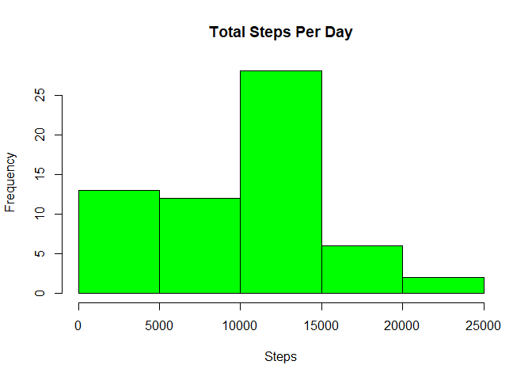
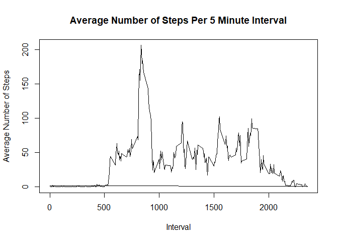

# Reproducible Reasearch - Week 2 Project

This report describes the reasearch on personal activity monitoring data set, which answers the following questions. 

1. How to load and preprocess the data?
2. What is mean of total number of steps taken per day?
3. How is the average daily activity pattern based on 5 minute interval and which interval has max average?
4. How to impute missing values to eliminate bias in results?
5. Are there differences in activity patterns between weekdays and weekends?


## How to Load and preprocess the data

The personal activity monitoring data  is captured using monitoring devices such as Fitbit, Nike Fuelband and Jawbone up. The following code loads the personal activity monitoring data into a table data frame.  


```r
library(dplyr)

dataFileURL<-"https://d396qusza40orc.cloudfront.net/repdata%2Fdata%2Factivity.zip"

dataZipFileLocalPath<-"./activity_data.zip"

download.file(dataFileURL, dataZipFileLocalPath)

unzip(dataZipFileLocalPath)

pam_data<-read.csv("activity.csv", header=TRUE)
pam_df<-tbl_df(pam_data)
```


## What is mean of total number of steps taken per day?

For calculating mean of the total number of steps per day create additional variable called total_steps in personal activity monitoring table and load values by calculating sum of the steps per the day. Using values in total_stpes variable calculate the mean and median of total steps and create histogram of total number of steps.


```r
pam_day_df<-pam_df %>% group_by(date)%>%summarise(total_steps=sum(steps,na.rm=TRUE),day_mean=mean(steps,na.rm=TRUE), day_median=median(steps,na.rm=TRUE))


hist(pam_day_df$total_steps, main='Total Steps Per Day', xlab= 'Steps', col="green")
```

<!-- -->

```r
mean_pam_day<-as.integer(mean(pam_day_df$total_steps,na.rm=TRUE))

median_pam_day<-as.integer(median(pam_day_df$total_steps,na.rm=TRUE))


print(paste("Mean of total steps per day :",mean_pam_day))
```

```
## [1] "Mean of total steps per day : 9354"
```

```r
print(paste("Median of total steps per day :",median_pam_day))
```

```
## [1] "Median of total steps per day : 10395"
```

## How is the average daily activity pattern based on 5 minute interval and which interval has max average?

The daily activity pattern is shown below as  a time series plot of the 5-minute interval (x-axis) and the average number of steps taken by averaging  across all days (y-axis). The daily activity pattern also shows Which 5-minute interval contains the maximum average number of steps


```r
pam_interval_df<-pam_df %>% group_by(interval)%>%mutate(total_steps=sum(steps,na.rm=TRUE),mean_steps=mean(steps,na.rm=TRUE),median_steps=median(steps,na.rm=TRUE))


plot(pam_interval_df$interval,pam_interval_df$mean_steps, type="l", xlab="Interval", ylab="Average Number of Steps",main="Average Number of Steps Per 5 Minute Interval")
```

<!-- -->

```r
index<-which.max(pam_interval_df$mean_steps)

interval_max<-pam_interval_df[index,]

print(paste("5 miute interval that has max average steps :",interval_max$interval))
```

```
## [1] "5 miute interval that has max average steps : 835"
```

## How to impute missing values to eliminate bias in results?

The personal activity monitoring data has missing values for steps and interval variables. The presence of missing days may introduce bias into some calculations or summaries of the data.

For imputing missing values the total number of missing values are identified and new data set is created by copying orginal data set and then filling missing values with mean for that 5 minute interval. 

In order to show how imputed data (with no missing values) will look like histograms are created for the total number of steps taken each day from original data set and imputed data set.


```r
#total number of missing values (NA)s
print(paste("Total number of missing values in the dataset :",sum(is.na(pam_df$steps))))
```

```
## [1] "Total number of missing values in the dataset : 2304"
```

```r
# row indexes of NAs
steps_na<-which(is.na(pam_df$steps)) 

pam_df_imputed<-pam_df

#impute with mean for that 5-minute interval

pam_df_imputed$steps[steps_na]<-pam_interval_df$mean_steps[steps_na]

# Hist to show impact of imputing missing data

par(mfrow=c(1,2),mar=c(4,4,2,1))

hist(pam_day_df$total_steps, main='Total Steps Per Day', xlab= 'Steps', col="Red", ylim=c(0,50))


pam_day_imputed_df<-pam_df_imputed %>% group_by(date)%>%summarise(total_steps=sum(steps))


hist(pam_day_imputed_df$total_steps, main='Total Steps Per Day', xlab= 'Steps', col="blue",ylim=c(0,50))
```

<!-- -->

```r
mean_pam_day_i<-as.integer(mean(pam_day_imputed_df$total_steps))

median_pam_day_i<-as.integer(median(pam_day_imputed_df$total_steps))

mean_diff<-mean_pam_day_i-mean_pam_day
median_diff<-median_pam_day_i-median_pam_day

print(paste("Difference in mean from imputed data set and original data set is :", mean_diff))
```

```
## [1] "Difference in mean from imputed data set and original data set is : 1412"
```

```r
print(paste("Difference in median from imputed data set and original data set is :", median_diff))
```

```
## [1] "Difference in median from imputed data set and original data set is : 371"
```

After replacing missing values with mean of the interval the total mean and median values are increased,which increases the qualtity of the research and helps in making right conclusions.


## Are there differences in activity patterns between weekdays and weekends?

In order to research on how personal activity is different between week days and week ends the new variable dayof_week is created in the data set. The panel plot containing time series plot for week day and week ends is created to see the activity difference between week days and week ends.


```r
#differences in activity patterns between weekdays and weekends

pam_dayof_week<-weekdays(as.Date(pam_df_imputed$date))


weekend_days<-c("Saturday", "Sunday")


dayof_week<-ifelse(is.element(pam_dayof_week,weekend_days),"Weekend","Weekday")

dayof_week_f<-as.factor(dayof_week)


pam_df_imputed<-pam_df_imputed%>%mutate(dayof_week=dayof_week_f)


pam_day_imputed_dw<-pam_df_imputed %>% group_by(interval,dayof_week)%>%mutate(dayofweek_mean_steps=mean(steps))
  

library(lattice)


xyplot(pam_day_imputed_dw$dayofweek_mean_steps ~ pam_day_imputed_dw$interval|pam_day_imputed_dw$dayof_week, main="Average Steps Per Interval and Day Of Week",xlab="Interval", ylab="Average Number Of Steps",layout=c(1,2), type="l")
```

<!-- -->
